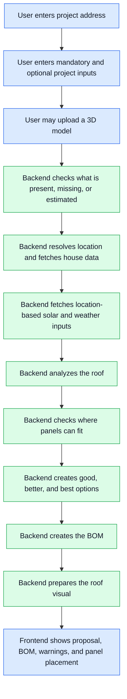

# Roofee Backend

FastAPI REST API for the Roofee app.

## Energy planning flow

Roofee turns a home into a practical energy-system proposal. The backend flow is:



1. **Find the home**
   - The user must enter a project address.

2. **Enter project details**
   - At the start, the user enters mandatory and optional inputs in one form.
   - The form is based mostly on the columns in `projects_status_quo.csv`.
   - Roofee can add extra fields when they help the backend make better sizing or BOM decisions.
   - Mandatory inputs are values Roofee needs before it can make a useful proposal.
   - Optional inputs make the result more accurate. If they are missing, Roofee can use defaults or estimates and show a warning.

   V1 frontend input contract:

   This table is the source of truth for the V1 frontend form.

   Required fields:

   | Field | Type | Notes |
   | --- | --- | --- |
   | `address` | string | Required first step. Used for location, roof lookup, solar yield, climate, and regional defaults. |
   | `annual_electricity_demand_kwh` | number | User-facing version of dataset field `energy_demand_wh`. |
   | `electricity_price_per_kwh` | number | User-facing version of dataset field `energy_price_per_wh`. |
   | `load_profile` | string | Default to `H0` for household customers if the user does not choose another profile. |
   | `num_inhabitants` | integer | User-facing version of dataset field `num_inhabitants`. |
   | `house_size_sqm` | number | Used for heat pump and heating fallback estimates. |
   | `heating_existing_type` | string | Allow `unknown` if the user does not know. |
   | `has_ev` | boolean | Existing or planned EV. |
   | `has_solar` | boolean | Existing PV system. |
   | `has_storage` | boolean | Existing battery storage. |
   | `has_wallbox` | boolean | Existing wallbox / EV charger. |
   | `recommendation_goal` | string | One of `balanced`, `lowest_upfront_cost`, `maximum_self_consumption`, `maximum_roof_usage`. |
   | `battery_preference` | string | One of `include`, `exclude`, `consider`. |
   | `heat_pump_preference` | string | One of `include`, `exclude`, `consider`. |
   | `ev_charger_preference` | string | One of `include`, `exclude`, `consider`. |

   Optional fields:

   | Field | Type | Notes |
   | --- | --- | --- |
   | `energy_price_increase` | number | Dataset field with the same name. |
   | `energy_price_with_flexible_tariff_per_kwh` | number | User-facing version of dataset field `energy_price_with_flexible_tariff`. |
   | `base_price_per_month` | number | Dataset field with the same name. |
   | `base_price_increase` | number | Dataset field with the same name. |
   | `ev_annual_drive_distance_km` | number | Useful when `has_ev` is true. |
   | `solar_size_kwp` | number | Existing PV size, if `has_solar` is true. |
   | `solar_angle` | number | Existing PV tilt/angle, if known. |
   | `solar_orientation` | number | Existing PV orientation, if known. |
   | `solar_built_year` | integer | Existing PV built year, if known. |
   | `solar_feedin_renumeration` | number | Existing feed-in tariff, if known. |
   | `solar_feedin_renumeration_post_eeg` | number | Existing post-EEG feed-in tariff, if known. |
   | `storage_size_kwh` | number | Existing battery size, if `has_storage` is true. |
   | `storage_built_year` | integer | Existing battery built year, if known. |
   | `wallbox_charge_speed_kw` | number | Existing wallbox speed, if `has_wallbox` is true. |
   | `heating_existing_cost_per_year` | number | Existing heating cost, if known. |
   | `heating_existing_cost_increase_per_year` | number | Existing heating cost increase, if known. |
   | `heating_existing_electricity_demand_kwh` | number | Existing heating electricity demand, if known. |
   | `heating_existing_heating_demand_kwh` | number | User-facing version of dataset field `heating_existing_heating_demand_wh`. |
   | `house_built_year` | integer | Useful for heat pump fallback estimates. |
   | `renovation_standard` | string | Extra V1 field, not directly in the dataset. |
   | `roof_covering_type` | string | Extra V1 field, useful for mounting/BOM assumptions. |
   | `electrical_panel_status` | string | Extra V1 field, useful for electrical work assumptions. |
   | `preferred_brands` | string array | Extra V1 field for product preferences. |
   | `excluded_brands` | string array | Extra V1 field for product constraints. |
   | `budget_range` | string | Extra V1 field for option ranking. |
   | `shading_level` | string | Extra V1 field. Suggested values: `none`, `low`, `medium`, `high`, `unknown`. |
   | `obstruction_notes` | string | Extra V1 field for seller notes. |
   | `usable_roof_area_sqm` | number | Required only if roof lookup/model analysis cannot provide it. |
   | `roof_tilt` | number | Required only if roof lookup/model analysis cannot provide it. |
   | `roof_azimuth` | number | Required only if roof lookup/model analysis cannot provide it. |

   Frontend submission route:

   ```text
   POST /api/recommendations
   Content-Type: multipart/form-data

   request=<JSON string containing the fields above>
   model_file=<optional .glb file>
   ```

   V1 validates the submitted inputs and optional `.glb` file, then returns a validation summary. Roof lookup, sizing, BOM generation, and 3D placement are later steps behind the same route.

3. **Upload optional 3D model**
   - The user may optionally upload a 3D model at the start.
   - The model can improve or override address-derived roof geometry.
   - If a model is uploaded, the backend validates that the file can be used for roof analysis.

4. **Fetch location data**
   - The backend resolves the address into an exact location and fetches available house/building data from external map providers.
   - The address is also used for location-based inputs such as solar irradiation, expected sun hours, climate assumptions, and regional defaults.

5. **Understand the roof**
   - The backend identifies usable roof surfaces.
   - It accounts for roof direction, tilt, available area, and known obstructions such as chimneys, skylights, windows, and unusable roof sections.

6. **Find possible solar layouts**
   - The backend looks at the available solar modules in the material catalog.
   - It checks which modules can physically fit on the usable roof area.
   - This step decides realistic panel counts and roof-plane placement options before any bill of materials is created.

7. **Size the energy system**
   - The backend estimates sensible `good`, `better`, and `best` system options.
   - It considers electricity demand, roof capacity, expected PV yield, battery usefulness, heat pump needs, EV plans, and user preferences.
   - Estimated or missing inputs are reported clearly so the seller knows what should be confirmed with the customer.

8. **Create the bill of materials**
   - The backend converts the selected system sizes into contractor-ready line items.
   - The BOM uses only components from the fixed material catalog extracted from the provided datasets.
   - The BOM includes core equipment, accessories, mounting, services, and installation-related items.

9. **Prepare the visual result**
   - The backend maps the selected panel layout back onto the best available roof geometry.
   - The frontend can then show the seller and customer where the proposed panels would actually go.

The important rule is that the BOM should not invent a system. Physical roof fit and sizing decisions happen first; the BOM translates those decisions into real catalog components and quantities.

## Backend architecture

The backend is organized around service responsibilities rather than one large calculation pipeline.

- `CatalogService`
  - Loads the fixed component catalog from `data/*/project_options_parts.csv`.
  - Deduplicates observed materials.
  - Classifies components as modules, inverters, batteries, heat pumps, wallboxes, accessories, mounting, services, packages, or other items.
  - Parses useful specs from component names when exported numeric columns are missing or inconsistent.

- `GeocodingService` / external Google clients
  - Resolve addresses into exact locations.
  - Fetch map, tile, building, or imagery data.
  - Keep Google-specific API details isolated from the rest of the backend.

- `ModelIngestionService`
  - Accepts optional uploaded 3D model data.
  - Validates file type, structure, and basic suitability before the model is used to improve roof calculations.
  - The address remains mandatory even when a model is uploaded, because location is needed for solar yield, climate, and regional assumptions.

- `ProjectInputService`
  - Handles the start form where the user enters mandatory and optional inputs.
  - Checks which mandatory inputs are present or missing.
  - Marks which optional inputs were estimated.
  - Converts user-friendly units into backend units.

- `RoofAnalysisService`
  - Determines roof planes, tilt, azimuth, usable area, and obstructions.
  - Produces the roof facts needed for panel placement and sizing.

- `SolarLayoutService`
  - Takes usable roof geometry and candidate PV modules from the catalog.
  - Calculates how many panels can physically fit and where they can go.
  - Produces feasible layouts that downstream sizing and BOM logic must respect.

- `EnergySizingService`
  - Orchestrates the `good`, `better`, and `best` recommendations.
  - Coordinates PV sizing, battery sizing, heat pump sizing, assumptions, warnings, and confidence.

- `PvSizingService`
  - Uses feasible solar layouts, customer demand, roof orientation, and PV yield data to choose target PV sizes.

- `BatterySizingService`
  - Recommends whether a battery is useful and what capacity makes sense for the selected PV size and household demand.

- `HeatPumpSizingService`
  - Uses known heating demand when available.
  - Falls back to estimates from home size, construction class, occupants, and location when needed.

- `BomService`
  - Converts a selected system option into BOM line items.
  - Selects only from catalog components.
  - Adds required accessories, mounting, services, and installation items.

- `PanelPlacementService`
  - Converts the selected solar layout into frontend-renderable geometry on the best available roof representation.
  - Uses an uploaded 3D model when available; otherwise uses address-derived roof geometry.
  - This is separate from BOM generation because visual placement is about geometry, not materials.

Suggested mature service layout:

```text
app/services/
  catalog_service.py
  location/
    geocoding_service.py
    google_maps_client.py
    google_tiles_client.py
  model/
    model_ingestion_service.py
    model_validation_service.py
    panel_placement_service.py
  project/
    project_input_service.py
    project_validation_service.py
  roof/
    roof_analysis_service.py
    obstruction_service.py
    solar_layout_service.py
  sizing/
    energy_sizing_service.py
    pv_sizing_service.py
    battery_sizing_service.py
    heat_pump_sizing_service.py
  bom/
    bom_service.py
    component_selection_service.py
  external/
    pvgis_client.py
```

For the hackathon version, these may start as fewer files. The boundaries should still stay clear:

- roof and layout logic decides what is physically possible
- project input logic handles mandatory inputs, optional inputs, missing values, and estimates
- sizing logic decides what system sizes make sense
- BOM logic turns selected systems into catalog-backed line items
- placement logic draws the chosen layout onto the best available roof geometry
- external clients isolate third-party APIs

## Local development

```bash
python3 -m venv .venv
. .venv/bin/activate
pip install -e ".[dev]"
uvicorn app.main:app --reload
```

The API runs on `http://localhost:8000` by default.

## Structure

- `app/api`: REST route modules
- `app/core`: configuration and app-wide concerns
- `app/models`: response and domain models
- `app/services`: service layer modules
- `data`: local data files consumed by backend services
