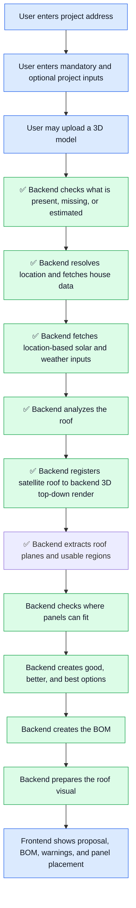

# Roofee Backend

FastAPI REST API for the Roofee app.

## Energy planning flow

Roofee turns a home into a practical energy-system proposal. The backend flow is:



1. **Find the home**
   - The user must enter a project address.

2. **Enter project details**
   - At the start, the user enters mandatory and optional inputs in one form.
   - The form is based mostly on the columns in `projects_status_quo.csv`.
   - Roofee can add extra fields when they help the backend make better sizing or BOM decisions.
   - Mandatory inputs are values Roofee needs before it can make a useful proposal.
   - Optional inputs make the result more accurate. If they are missing, Roofee can use defaults or estimates and show a warning.

   V1 frontend input contract:

   This table is the source of truth for the V1 frontend form.

   Required fields:

   | Field | Type | Notes |
   | --- | --- | --- |
   | `address` | string | Required first step. The backend validates this only as a non-empty string in V1. |
   | `latitude` | number | Required coordinate from frontend Google Places selection. Must be between -90 and 90. |
   | `longitude` | number | Required coordinate from frontend Google Places selection. Must be between -180 and 180. |
   | `annual_electricity_demand_kwh` | number | User-facing version of dataset field `energy_demand_wh`. |
   | `electricity_price_per_kwh` | number | User-facing version of dataset field `energy_price_per_wh`. |
   | `load_profile` | string | Default to `H0` for household customers if the user does not choose another profile. |
   | `num_inhabitants` | integer | User-facing version of dataset field `num_inhabitants`. |
   | `house_size_sqm` | number | Used for heat pump and heating fallback estimates. |
   | `heating_existing_type` | string | Allow `unknown` if the user does not know. |
   | `has_ev` | boolean | Existing or planned EV. |
   | `has_solar` | boolean | Existing PV system. |
   | `has_storage` | boolean | Existing battery storage. |
   | `has_wallbox` | boolean | Existing wallbox / EV charger. |
   | `recommendation_goal` | string | One of `balanced`, `lowest_upfront_cost`, `maximum_self_consumption`, `maximum_roof_usage`. |
   | `battery_preference` | string | One of `include`, `exclude`, `consider`. |
   | `heat_pump_preference` | string | One of `include`, `exclude`, `consider`. |
   | `ev_charger_preference` | string | One of `include`, `exclude`, `consider`. |

   Optional fields:

   | Field | Type | Notes |
   | --- | --- | --- |
   | `energy_price_increase` | number | Dataset field with the same name. |
   | `energy_price_with_flexible_tariff_per_kwh` | number | User-facing version of dataset field `energy_price_with_flexible_tariff`. |
   | `base_price_per_month` | number | Dataset field with the same name. |
   | `base_price_increase` | number | Dataset field with the same name. |
   | `ev_annual_drive_distance_km` | number | Useful when `has_ev` is true. |
   | `solar_size_kwp` | number | Existing PV size, if `has_solar` is true. |
   | `solar_angle` | number | Existing PV tilt/angle, if known. |
   | `solar_orientation` | number | Existing PV orientation, if known. |
   | `solar_built_year` | integer | Existing PV built year, if known. |
   | `solar_feedin_renumeration` | number | Existing feed-in tariff, if known. |
   | `solar_feedin_renumeration_post_eeg` | number | Existing post-EEG feed-in tariff, if known. |
   | `storage_size_kwh` | number | Existing battery size, if `has_storage` is true. |
   | `storage_built_year` | integer | Existing battery built year, if known. |
   | `wallbox_charge_speed_kw` | number | Existing wallbox speed, if `has_wallbox` is true. |
   | `heating_existing_cost_per_year` | number | Existing heating cost, if known. |
   | `heating_existing_cost_increase_per_year` | number | Existing heating cost increase, if known. |
   | `heating_existing_electricity_demand_kwh` | number | Existing heating electricity demand, if known. |
   | `heating_existing_heating_demand_kwh` | number | User-facing version of dataset field `heating_existing_heating_demand_wh`. |
   | `house_built_year` | integer | Useful for heat pump fallback estimates. |
   | `renovation_standard` | string | Extra V1 field, not directly in the dataset. |
   | `roof_covering_type` | string | Extra V1 field, useful for mounting/BOM assumptions. |
   | `electrical_panel_status` | string | Extra V1 field, useful for electrical work assumptions. |
   | `preferred_brands` | string array | Extra V1 field for product preferences. |
   | `excluded_brands` | string array | Extra V1 field for product constraints. |
   | `budget_range` | string | Extra V1 field for option ranking. |
   | `shading_level` | string | Extra V1 field. Suggested values: `none`, `low`, `medium`, `high`, `unknown`. |
   | `obstruction_notes` | string | Extra V1 field for seller notes. |
   | `usable_roof_area_sqm` | number | Required only if roof lookup/model analysis cannot provide it. |
   | `roof_tilt` | number | Required only if roof lookup/model analysis cannot provide it. |
   | `roof_azimuth` | number | Required only if roof lookup/model analysis cannot provide it. |
   | `google_place_id` | string | Optional Google Places identifier captured by the frontend. |

   Frontend submission route:

   ```text
   POST /api/recommendations
   Content-Type: multipart/form-data

   request=<JSON string containing the fields above>
   model_file=<optional .glb file>
   ```

   ✅ Implemented: V1 validates the submitted inputs and optional `.glb` file, fetches baseline monthly solar/weather inputs from PVGIS using the submitted coordinates, fetches Google Solar overhead imagery, and returns a validation summary. Roof analysis, sizing, BOM generation, and 3D panel placement are later steps behind the same route.

   The frontend must send `latitude` and `longitude` from Google Places with the selected address. For a standalone Google Photorealistic 3D Tiles GLB, call `POST /api/location/house-model` with the same coordinates or with an address.

   Roof outline selection contract:

   `POST /api/recommendations` returns the satellite image and every detected roof/building outline:

   ```json
   {
     "house_data": {
       "overhead_image_url": "/api/house-assets/{asset_id}/overhead.png"
     },
     "roof_analysis": {
       "status": "analyzed",
       "satellite_image_url": "/api/house-assets/{asset_id}/overhead.png",
       "roof_outlines": [
         {
           "id": "roof-001",
           "source": "huggingface_yolov8",
           "model_id": "keremberke/yolov8m-building-segmentation",
           "class_name": "Building",
           "bounding_box_pixels": {
             "x_min": 42,
             "y_min": 61,
             "x_max": 128,
             "y_max": 155
           },
           "polygon_pixels": [[42, 61], [128, 64], [121, 155], [44, 148]],
           "area_pixels": 2908.5,
           "confidence": 0.634
         }
       ]
     }
   }
   ```

   The frontend should render `roof_analysis.satellite_image_url` and draw/select from `roof_outlines[*].bounding_box_pixels`. After the user selects the exact target roof, send only backend-provided IDs back:

   ```http
   POST /api/roof/selection
   Content-Type: application/json
   ```

   ```json
   {
     "satellite_image_url": "/api/house-assets/{asset_id}/overhead.png",
     "selected_roof_outline_ids": ["roof-003"]
   }
   ```

   Multiple IDs are allowed only when their bounding boxes touch or overlap, so the selection still represents one connected roof. The backend validates the selection and returns the focused roof geometry:

   ```json
   {
     "status": "selected",
     "selected_roof": {
       "satellite_image_url": "/api/house-assets/{asset_id}/overhead.png",
       "selected_roof_outline_ids": ["roof-003"],
       "selected_roof_outlines": [
         {
           "id": "roof-003",
           "source": "huggingface_yolov8",
           "model_id": "keremberke/yolov8m-building-segmentation",
           "class_name": "Building",
           "bounding_box_pixels": {
             "x_min": 42,
             "y_min": 61,
             "x_max": 128,
             "y_max": 155
           },
           "polygon_pixels": [[42, 61], [128, 64], [121, 155], [44, 148]],
           "area_pixels": 2908.5,
           "confidence": 0.634
         }
       ],
       "bounding_box_pixels": {
         "x_min": 42,
         "y_min": 61,
         "x_max": 128,
         "y_max": 155
       },
       "area_pixels": 2908.5
     },
     "warnings": []
   }
   ```

   Roof obstruction analysis contract:

   After the frontend has selected the exact roof outline IDs, call the obstruction route with the same payload shape:

   ```http
   POST /api/roof/obstructions
   Content-Type: application/json
   ```

   ```json
   {
     "satellite_image_url": "/api/house-assets/{asset_id}/overhead.png",
     "selected_roof_outline_ids": ["roof-003"]
   }
   ```

   The backend revalidates the selected roof, crops the selected roof area from the overhead image, runs the RID U-Net detector inside the backend process, maps returned obstruction polygons back to full-image pixels, and returns the focused roof plus obstruction polygons:

   ```json
   {
     "status": "analyzed",
     "selected_roof": {
       "...": "same focused roof geometry returned by /api/roof/selection"
     },
     "obstructions": [
       {
         "id": "obstruction-001",
         "class_name": "chimney",
         "polygon_pixels": [[100, 120], [115, 122], [113, 140]],
         "bounding_box_pixels": {
           "x_min": 100,
           "y_min": 120,
           "x_max": 115,
           "y_max": 140
         },
         "area_pixels": 247,
         "confidence": 0.834,
         "source": "rid_unet",
         "model_id": "rid_unet_resnet34_best"
       }
     ],
     "warnings": []
   }
   ```

   The RID detector loads `backend/models/obstruction_detection/rid_unet_resnet34_best.h5` lazily on the first obstruction request and keeps the model in memory for the backend process. Configure `ROOFEE_RID_MODEL_CHECKPOINT_PATH` if the checkpoint is mounted somewhere else. The original RID runtime uses TensorFlow 2.10 and `segmentation-models==1.0.1`; run the backend with a compatible Python/TensorFlow environment when enabling real obstruction inference. Normal route and service tests use fake detectors and do not load the model.

   Roof-to-3D registration contract:

   After the frontend has selected the exact satellite roof outline IDs and loaded a GLB, it generates a deterministic top-down orthographic render of the model. The render must be independent of the user's current orbit camera. Send the PNG and render metadata to:

   ```http
   POST /api/roof/registration
   Content-Type: multipart/form-data
   ```

   ```json
   {
     "satellite_image_url": "/api/house-assets/{asset_id}/overhead.png",
     "selected_roof_outline_ids": ["roof-003"],
     "top_down_render_metadata": {
       "render_width": 1024,
       "render_height": 1024,
       "orthographic_world_bounds": {
         "x_min": -12.0,
         "x_max": 12.0,
         "z_min": -12.0,
         "z_max": 12.0,
         "y_min": 0.0,
         "y_max": 8.0
       },
       "model_orientation": {
         "up_axis": "y",
         "camera_direction": [0, -1, 0],
         "camera_up": [0, 0, -1]
       }
     }
   }
   ```

   The backend revalidates the selected satellite roof, matches ORB features between the satellite image and top-down render, retries with AKAZE when ORB cannot produce a reliable match, estimates a similarity transform with RANSAC, and maps the selected satellite roof polygon into render pixels:

   ```json
   {
     "status": "registered",
     "selected_roof": {
       "...": "same focused roof geometry returned by /api/roof/selection"
     },
     "transform": {
       "matrix": [[1.05, -0.12, 41.2], [0.12, 1.05, 18.7]],
       "scale": 1.057,
       "rotation_degrees": 6.52,
       "translation_pixels": [41.2, 18.7],
       "algorithm": "orb"
     },
     "mapped_roof_polygon_pixels": [[92, 104], [310, 120], [292, 284], [80, 260]],
     "quality": {
       "algorithm": "orb",
       "confidence": 0.91,
       "satellite_keypoints": 812,
       "render_keypoints": 645,
       "good_matches": 140,
       "inliers": 86,
       "inlier_ratio": 0.614,
       "mean_reprojection_error_pixels": 2.4
     },
     "warnings": []
   }
   ```

   The satellite roof polygon remains the source of truth. The returned render-pixel polygons are alignment products for visualization and for pixel-to-model placement; V1 does not use shear or homography. The response preserves each selected roof outline separately in `mapped_roof_outlines` and keeps `mapped_roof_polygon_pixels` only as a legacy convenience field.

   Backend-owned roof geometry contract:

   After the frontend sends the selected roof IDs, the backend can run the rest of the geometry pipeline without a frontend-supplied render:

   ```http
   POST /api/roof/geometry
   Content-Type: application/json
   ```

   ```json
   {
     "satellite_image_url": "/api/house-assets/{asset_id}/overhead.png",
     "selected_roof_outline_ids": ["roof-003"],
     "model_radius_m": 50,
     "roof_edge_setback_m": 0.35,
     "obstruction_buffer_m": 0.25
   }
   ```

   The backend loads or fetches the cached Google 3D Tiles GLB for the same house asset, generates its own deterministic top-down render, registers the selected satellite roof polygons, extracts roof planes from mesh normals, maps obstructions into model coordinates, and subtracts setbacks/obstruction buffers with Shapely. The response includes `roof_planes`, `mapped_obstructions`, `usable_regions`, and `removed_areas`; panel layout and BOM generation must consume those feasible regions instead of raw roof area.

3. **Upload optional 3D model**
   - The user may optionally upload a 3D model at the start.
   - The model can improve or override address-derived roof geometry.
   - If a model is uploaded, the backend validates that the file can be used for roof analysis.

4. **Fetch location data**
   - The backend resolves the address into an exact location and fetches available house/building data from external map providers.
   - The address is also used for location-based inputs such as solar irradiation, expected sun hours, climate assumptions, and regional defaults.
   - V1 already uses frontend-provided coordinates to fetch PVGIS monthly horizontal irradiation, optimal-plane irradiation, and average temperature. If PVGIS fails, the recommendation route returns `502` instead of fake fallback data.
   - `POST /api/location/house-model` resolves an address or accepts latitude/longitude, walks Google Photorealistic 3D Tiles around that anchor, selects the best intersecting leaf GLB, and returns `model/gltf-binary`. Structured tile metadata is JSON-encoded in the `Roofee-Metadata` response header.
   - The route requires `ROOFEE_GOOGLE_API_KEY` or `ROOFEE_GOOGLE_MAPS_API_KEY` enabled for Geocoding API and Map Tiles API.

5. **Understand the roof**
   - The backend identifies usable roof surfaces.
   - It accounts for roof direction, tilt, available area, and known obstructions such as chimneys, skylights, windows, and unusable roof sections.

   ✅ Implemented: V1 detects candidate building/roof outlines from the overhead image, validates a focused roof selection, and runs selected-roof obstruction detection through an isolated RID U-Net runtime. Full usable-area subtraction for panel placement remains part of the solar layout step.

6. **Register the satellite roof to the 3D model**
   - The backend loads or fetches the project GLB and renders it from a fixed top-down orthographic camera.
   - The backend aligns the satellite image to that render with translation, rotation, and uniform scale only.
   - The selected satellite roof polygons remain the source of truth and are mapped separately into 3D-render pixels and model `x/z` coordinates.
   - Low-confidence registration is reported with warnings instead of silently feeding panel placement.

   ✅ Implemented: V1 exposes `POST /api/roof/registration` for compatibility and `POST /api/roof/geometry` for the backend-owned flow. Registration recovers a satellite-to-render similarity transform with ORB/AKAZE + RANSAC, rejects unreliable transforms, and returns each selected roof polygon mapped onto the deterministic top-down render.

7. **Extract roof planes and usable roof geometry**
   - The backend parses the GLB mesh, filters upward roof-like faces inside the selected roof footprint, and clusters connected faces by similar normals and plane offsets.
   - Each roof plane reports footprint geometry, surface area, tilt, azimuth, source face count, and a deterministic suitability score.
   - The backend subtracts roof-edge setbacks and buffered obstruction polygons with Shapely, preserving split free regions and traceable removed areas.

   ✅ Implemented: `POST /api/roof/geometry` returns roof planes, mapped obstructions, usable regions, removed areas, and warnings. The geometry uses model-local `x/z` coordinates for V1, with `y` as the up axis.

8. **Find possible solar layouts**
   - The backend looks at the available solar modules in the material catalog.
   - It checks which modules can physically fit on the usable roof area.
   - This step decides realistic panel counts and roof-plane placement options before any bill of materials is created.

9. **Size the energy system**
   - The backend estimates sensible `good`, `better`, and `best` system options.
   - It considers electricity demand, roof capacity, expected PV yield, battery usefulness, heat pump needs, EV plans, and user preferences.
   - Estimated or missing inputs are reported clearly so the seller knows what should be confirmed with the customer.

10. **Create the bill of materials**
   - The backend converts the selected system sizes into contractor-ready line items.
   - The BOM uses only components from the fixed material catalog extracted from the provided datasets.
   - The BOM includes core equipment, accessories, mounting, services, and installation-related items.

11. **Prepare the visual result**
   - The backend maps the selected panel layout back onto the best available roof geometry.
   - The frontend can then show the seller and customer where the proposed panels would actually go.

The important rule is that the BOM should not invent a system. Physical roof fit and sizing decisions happen first; the BOM translates those decisions into real catalog components and quantities.

## Backend architecture

The backend is organized around service responsibilities rather than one large calculation pipeline.

- `CatalogService`
  - Loads the fixed component catalog from `data/*/project_options_parts.csv`.
  - Deduplicates observed materials.
  - Classifies components as modules, inverters, batteries, heat pumps, wallboxes, accessories, mounting, services, packages, or other items.
  - Parses useful specs from component names when exported numeric columns are missing or inconsistent.

- `GeocodingService` / external Google clients
  - Resolve addresses into exact locations.
  - Fetch map, tile, building, or imagery data.
  - Keep Google-specific API details isolated from the rest of the backend.

- `ModelIngestionService`
  - Accepts optional uploaded 3D model data.
  - Validates file type, structure, and basic suitability before the model is used to improve roof calculations.
  - The address remains mandatory even when a model is uploaded, because location is needed for solar yield, climate, and regional assumptions.

- `ProjectInputService`
  - Handles the start form where the user enters mandatory and optional inputs.
  - Checks which mandatory inputs are present or missing.
  - Marks which optional inputs were estimated.
  - Converts user-friendly units into backend units.

- `RoofAnalysisService`
  - Detects address-derived building/roof outlines.
  - Validates selected roof outline IDs and returns focused roof geometry.
  - Produces the selected roof facts needed for obstruction detection, panel placement, and sizing.

- `RoofObstructionService`
  - Crops the selected roof area from the overhead image.
  - Calls the backend-local RID U-Net detector abstraction.
  - Maps obstruction polygons from crop pixels back to full-image pixels.
  - Filters ignored classes, low-confidence detections, tiny polygons, and detections outside the selected roof.

- `RoofRegistrationService`
  - Revalidates selected satellite roof outline IDs.
  - Matches satellite and top-down model-render features with ORB, then AKAZE as fallback.
  - Estimates only a similarity transform with RANSAC.
  - Maps the selected satellite roof polygon into deterministic render-pixel space.
  - Reports transform quality, confidence, and warnings for low-feature or unreliable alignments.

- `SolarLayoutService`
  - Takes usable roof geometry and candidate PV modules from the catalog.
  - Calculates how many panels can physically fit and where they can go.
  - Produces feasible layouts that downstream sizing and BOM logic must respect.

- `EnergySizingService`
  - Orchestrates the `good`, `better`, and `best` recommendations.
  - Coordinates PV sizing, battery sizing, heat pump sizing, assumptions, warnings, and confidence.

- `PvSizingService`
  - Uses feasible solar layouts, customer demand, roof orientation, and PV yield data to choose target PV sizes.

- `BatterySizingService`
  - Recommends whether a battery is useful and what capacity makes sense for the selected PV size and household demand.

- `HeatPumpSizingService`
  - Uses known heating demand when available.
  - Falls back to estimates from home size, construction class, occupants, and location when needed.

- `BomService`
  - Converts a selected system option into BOM line items.
  - Selects only from catalog components.
  - Adds required accessories, mounting, services, and installation items.

- `PanelPlacementService`
  - Converts the selected solar layout into frontend-renderable geometry on the best available roof representation.
  - Uses an uploaded 3D model when available; otherwise uses address-derived roof geometry.
  - This is separate from BOM generation because visual placement is about geometry, not materials.

Suggested mature service layout:

```text
app/services/
  catalog_service.py
  location/
    geocoding_service.py
    google_maps_client.py
    google_tiles_client.py
  model/
    model_ingestion_service.py
    model_validation_service.py
    panel_placement_service.py
  project/
    project_input_service.py
    project_validation_service.py
  roof/
    roof_analysis_service.py
    obstruction_service.py
    registration_service.py
    solar_layout_service.py
  sizing/
    energy_sizing_service.py
    pv_sizing_service.py
    battery_sizing_service.py
    heat_pump_sizing_service.py
  bom/
    bom_service.py
    component_selection_service.py
  external/
    pvgis_client.py
```

For the hackathon version, these may start as fewer files. The boundaries should still stay clear:

- roof and layout logic decides what is physically possible
- project input logic handles mandatory inputs, optional inputs, missing values, and estimates
- sizing logic decides what system sizes make sense
- BOM logic turns selected systems into catalog-backed line items
- placement logic draws the chosen layout onto the best available roof geometry
- external clients isolate third-party APIs

## Local development

```bash
python3 -m venv .venv
. .venv/bin/activate
pip install -e ".[dev]"
uvicorn app.main:app --reload
```

The API runs on `http://localhost:8000` by default.

RID obstruction detection runs in-process. The default checkpoint path is
`models/obstruction_detection/rid_unet_resnet34_best.h5` relative to the
backend directory. Relevant config:

```bash
ROOFEE_RID_MODEL_CHECKPOINT_PATH="models/obstruction_detection/rid_unet_resnet34_best.h5"
ROOFEE_RID_INFERENCE_IMAGE_SIZE=512
ROOFEE_RID_DEVICE=""  # use "cpu" to hide GPUs, or a TensorFlow device string
ROOFEE_RID_MIN_POLYGON_AREA_PIXELS=50
ROOFEE_ROOF_OBSTRUCTION_MIN_CONFIDENCE=0.5
```

To install the original RID dependencies in a compatible environment:

```bash
pip install -e ".[dev,rid]"
```

The bundled checkpoint was trained with TensorFlow 2.10, which is intended for
Python 3.10 or older. If the backend runs on a newer Python, the service still
starts, but real obstruction detection returns a `503` until compatible RID ML
dependencies are installed or the model is converted to a newer runtime.

## Structure

- `app/api`: REST route modules
- `app/core`: configuration and app-wide concerns
- `app/models`: response and domain models
- `app/services`: service layer modules
- `data`: local data files consumed by backend services
